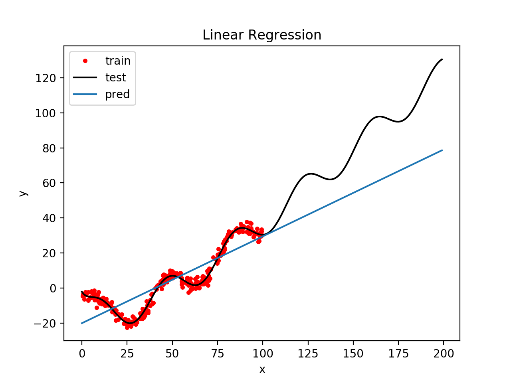

# 作业1：线性回归

**截止日期：2018年4月4日**

## 问题

有一个函数$f: \textbb{R} \to \textbb{R}$，使得$y = f(x)$。现在不知道函数$f(\cdot)$的具体形式，给定满足函数关系的一组训练样本$\left{ (x_1,y_1), ..., (x_N,y_N) \right}, N=300$，请使用线性回归拟合出函数$y = f(x)$。(可尝试一种或几种不同的基函数，如多项式、高斯或sigmoidal）

## 要求：

- 使用训练集`train.txt`进行训练，使用测试集`test.txt`进行评估（标准差），训练模型时请不要使用测试集。
- 请使用代码模板`linear_reg.py`，补全其中缺失的代码。尽量不要改动主要接口，可自由添加所需的函数。
- 推荐使用python及numpy编写代码，教程可参考[cs231n-numpy-tutorial](http://cs231n.github.io/python-numpy-tutorial/#numpy-math)。
- 请同时提交代码和报告，打包成压缩包，命名为`学号_姓名.zip`。报告字数不作要求，报告内容尽量简明扼要，提交为pdf格式。报告至少应包含以下两部分部分：方法简介，结果展示（图、表及标准差）。示例结果图如下：

## 注意事项

- 本次作业占总成绩10%。按时提交的作业成绩不低于8%。
- 请在截止日期之前提交作业。每迟交24小时，扣该次作业成绩的20%，扣完为止。
- 请直接在elearning上提交作业。如有其他疑问，请联系助教zke17@fudan.edu.cn。

