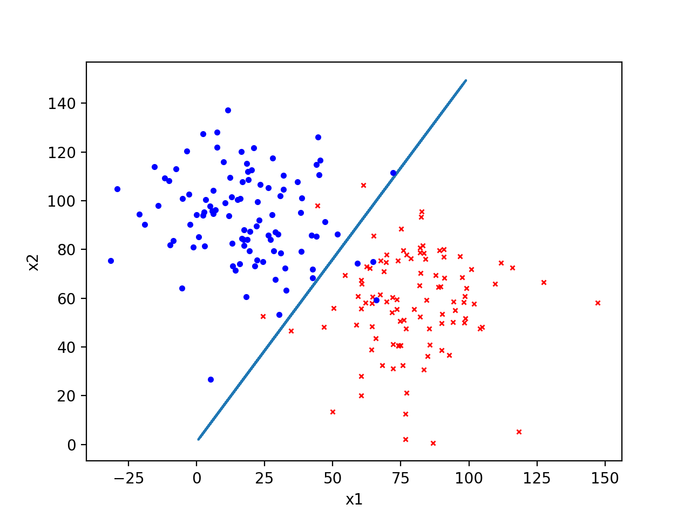

# 作业2：SVM

**截止日期：2018年5月13日**

## 问题 (20%)

本次作业分为三个部分：

1. 使用基于某种核函数（线性，多项式或高斯核函数）的SVM解决非线性可分的二分类问题，数据集为`train_kernel.txt`及`test_kernel.txt`。（**10%**）

2. 分别使用线性分类器（squared error）、logistic回归（cross_entropy error）以及SVM（hinge error)解决线性二分类问题，并比较三种模型的效果。数据集为`train_linear.txt`及`test_linear.txt`。（**5%**）
三种误差函数定义如下（Bishop P327）：
$$
E_{linear} = \sum_{n=1}^{N} (y_n-t_n)^2 + \lambda \|\mathbf{w}\|^2 \\
E_{logistic} = \sum_{n=1}^{N} \log(1+\exp(-y_n t_n)) + \lambda \|\mathbf{w}\|^2 \\
E_{SVM} = \sum_{n=1}^{N} [1 - y_n t_n]_+ + \lambda \|\mathbf{w}\|^2 \\
$$
其中$y_n=\mathbf{w}^T \mathbf{x}_n + b$，$t_n$为类别标签。

3. 使用多分类SVM解决三分类问题。数据集为`train_multi.txt`及`test_multi.txt`。（**5%**）

## 说明

- 使用训练集`train_x.txt`进行训练，使用测试集`test_x.txt`进行评估（准确率），训练模型时请不要使用测试集。
- 数据集按`x1 x2 t`的格式来组织，每行代表一个样例。在二分类中，标签t取值为1或-1，在三分类中t取值为-1，0，1。
- 请使用代码模板`svm.py`，补全其中缺失的代码，可自由添加所需的函数或进行修改。
- 推荐使用python及numpy编写代码，也可使用其他简单的框架。
- 请同时提交代码和报告，打包成压缩包，命名为`学号_姓名.zip`。报告字数不作要求，报告内容尽量简明扼要，提交为pdf格式。报告至少应包含以下两部分部分：方法简介，结果展示（图、表等）。示例结果图如下：

## 注意事项

- 本次作业占总成绩20%。
- 请按时在截止日期之前提交作业。每迟交24小时，扣该次作业成绩的20%，扣完为止。
- 请直接在elearning上提交作业。如有其他疑问，请联系助教<zke17@fudan.edu.cn>。
- 请勿抄袭其他人作业，遵守诚信守则。
